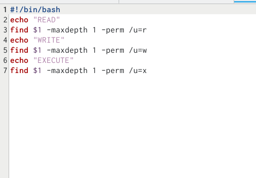

---
## Front matter
lang: ru-RU
title: "Лабораторная работа №10"
subtitle: "Программирование в командном
процессоре ОС UNIX. Командные файлы"
author:
  - Пашаев Юсиф Юнусович
institute:
  - Российский университет дружбы народов, Москва, Россия
date: 12 апреля 2023

## i18n babel
babel-lang: russian
babel-otherlangs: english

## Formatting pdf
toc: false
toc-title: Содержание
slide_level: 2
aspectratio: 169
section-titles: true
theme: metropolis
header-includes:
 - \metroset{progressbar=frametitle,sectionpage=progressbar,numbering=fraction}
 - '\makeatletter'
 - '\beamer@ignorenonframefalse'
 - '\makeatother'
---

## Цели и задачи

Изучить основы программирования в оболочке ОС UNIX/Linux. Научиться писать
небольшие командные файлы

## Содержание исследования

1. Пишем  скрипт, который при запуске будет делать резервную копию самого себя (то
есть файла, в котором содержится его исходный код) в другую директорию backup
в вашем домашнем каталоге 

##

{#fig:001 width=70%}

##

{#fig:002 width=70%}

##

2. Пишем пример командного файла, обрабатывающего любое произвольное число
аргументов командной строки, в том числе превышающее десять 

##

{#fig:003 width=70%}

##

{#fig:004 width=70%}

##

3. Напишем командный файл — аналог команды ls (без использования самой этой ко-
манды и команды dir). Требуется, чтобы он выдавал информацию о нужном каталоге
и выводил информацию о возможностях доступа к файлам этого каталога. 

##

{#fig:005 width=70%}

##

{#fig:006 width=70%}

##

4. Напишем командный файл, который получает в качестве аргумента командной строки
формат файла (.txt, .doc, .jpg, .pdf и т.д.) и вычисляет количество таких файлов
в указанной директории. Путь к директории также передаётся в виде аргумента командной строке 

##

{#fig:007 width=70%}

##

{#fig:008 width=70%}

## Результаты

Я изучил основы программирования в оболочке ОС UNIX/Linux. Научился писать
небольшие командные файлы.

